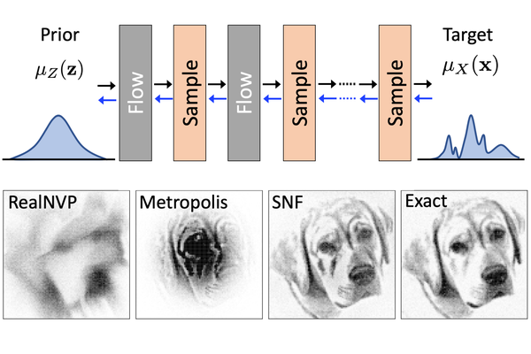

Stochastic Normalizing Flows
----------------------------
We introduce stochasticity in Boltzmann-generating flows. Normalizing flows are exact-probability generative models that can efficiently sample x and compute the generation probability p(x), so that probability-based methods can be used to train the generator. Boltzmann-generating flows combine flows and reweighting in order to learn to generate unbiased samples with respect to some target density exp(-u(x)) that is approximated by p(x) and then reweighted. Here we introduce sochasticity in Boltzmann-generating flows. The key methodological advance is that we avoid to compute p(x) point-wise, which would require an intractable integration over all paths mapping to the same x, and show how both training of the flow and reweighting of p(x) to exp(-u(x)) can be done via path sampling and without requiring p(x) explicitly.



Publication
-----------
Please find the arxiv preprint here:
https://arxiv.org/abs/2002.06707

Stochastic Normalizing Flows is in press in NeurIPS 2020, citation update is coming up...
```
@article{snf,
  title={Stochastic Normalizing Flows},
  author={H. Wu and J. K{\"o}hler and F. {\'e}},
  journal = {arxiv:2002.06707},
  year = {2020}
}
```


Installation and running experiments
------------
**System requirements**
All experiments were run with Python 3.7 and PyTorch 1.5 on MacOS.
They are expected to work on MacOS and Linux systems with these or newer Python and PyTorch versions

**Installation**
Install the bgtorch flow package
```
cd bgtorch
python setup.py develop
cd ..
```

Install snf_code package (specialized code for this paper)
```
cd snf_code
python setup.py develop
cd ..
```

Optional: install OpenMM for running experiment 3
```
conda install -c omnia openmm 
conda install -c omnia openmmtools 
```

**Run Experiments**
* To run experiments 1-3, open and run the respective notebooks with jupyter
* To run experiment 4, run the respective Python file directly

